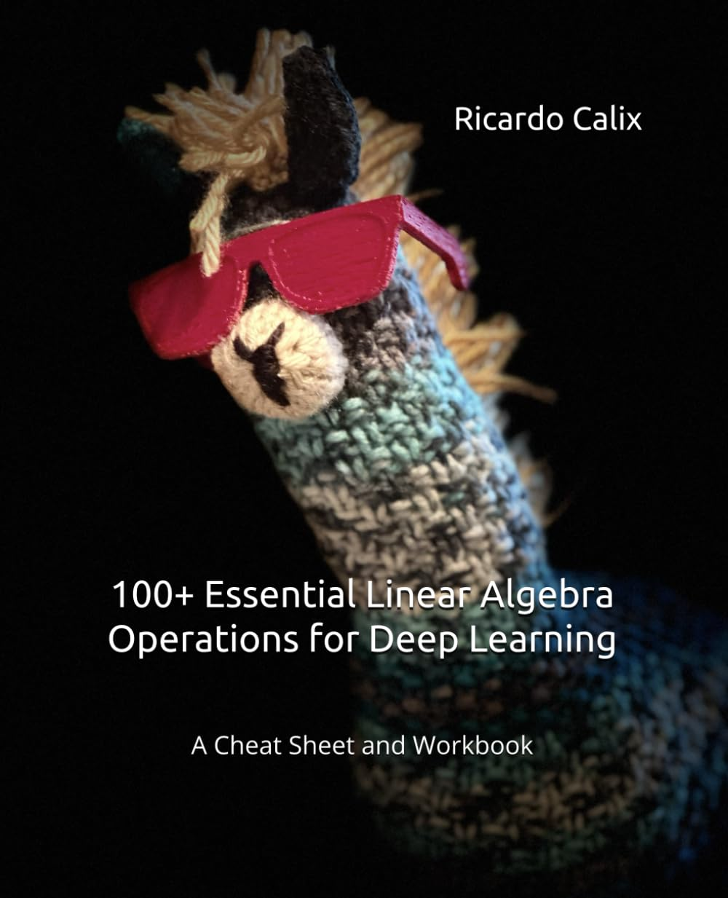

## Problems 1 to 15

* Jupyter notebooks

## Book

This is the repo for my new book "100 + Essential Linear Algebra Operations For Deep Learning".

## FTC and Amazon Disclaimer: 

This post/page/article includes Amazon Affiliate links to products. This site receives income if you purchase through these links. This income helps support content such as this one. Content may also be supported by Generative AI and Recommender Advertisements.
