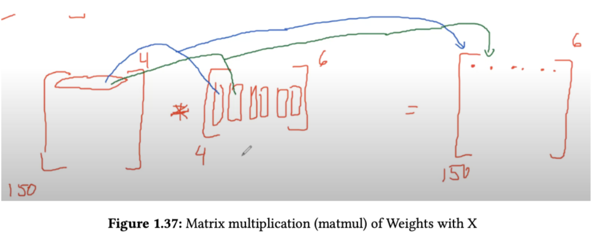

# 100 + Essential Linear Algebra Operations For Deep Learning

* Companion to my book of the same name
* Jupyter notebooks for problems 1 to 109
* AGS

---

# 🔢 Dot Product Example with PyTorch

This is a minimal example that demonstrates how to compute the **dot product** of two vectors using PyTorch.


## 🧪 Example Code

```python
import torch

# Define two 1D tensors (vectors)
a = torch.tensor([1.0, 2.0, 3.0])
b = torch.tensor([4.0, 5.0, 6.0])

# Compute dot product using torch.dot
dot_product = torch.dot(a, b)

print(f"Dot product: {dot_product.item()}")
```

## ✅ Output

```
Dot product: 32.0
```

## 📘 Explanation

The dot product of two vectors is calculated as:

```
1×4 + 2×5 + 3×6 = 4 + 10 + 18 = 32
```

## 🧠 Notes

- `torch.dot` requires both inputs to be 1D tensors of the same length.
- For matrix-style multiplication, use `torch.matmul` instead.


## Matrix Multiplication



# 🧼 Matrix Multiplication Example in PyTorch

This minimal example demonstrates how **matrix multiplication** works in PyTorch using `torch.matmul`, a foundational operation in deep learning and linear algebra.

---

## 📌 Objective

Multiply a matrix `x` of shape `[150, 4]` with a weight matrix `w` of shape `[4, 6]` to produce an output matrix `y` of shape `[150, 6]`.

This operation is commonly used in:

* Linear layers (`y = x @ W`)
* Feature transformations
* Neural network forward passes

---

## 💾 Code Overview

```python
import torch

# Input matrix: 150 samples with 4 features each
x = torch.randn(150, 4)

# Weight matrix: transforms 4D features into 6D
w = torch.randn(4, 6)

# Matrix multiplication: outputs shape [150, 6]
y = torch.matmul(x, w)
```

---

## 📀 Shapes Summary

| Variable | Shape     | Description                       |
| -------- | --------- | --------------------------------- |
| `x`      | \[150, 4] | 150 samples, each with 4 features |
| `w`      | \[4, 6]   | Transformation matrix             |
| `y`      | \[150, 6] | Output: 150 samples, now 6D       |

---

## 🧠 Why This Matters

This is the core of how neural networks compute outputs:
A layer transforms input features into a new representation by **multiplying by a learned weight matrix**.

This example is the essence of:

```python
y = x @ W + b
```

used in every `nn.Linear` layer.

---

## 🚀 Run It

To execute this code:

```bash
pip install torch
python your_script.py
```

Or run it inside a Jupyter notebook cell.

---

## ✅ Output

```python
print(y.shape)
# Output: torch.Size([150, 6])
```

This confirms that 150 input vectors were each projected into 6-dimensional space.


---

## Book

This is the repo for my new book "100 + Essential Linear Algebra Operations For Deep Learning".


<a href="https://amzn.to/3SlQGHC"></a>

## FTC and Amazon Disclaimer: 

This post/page/article includes Amazon Affiliate links to products. This site receives income if you purchase through these links. This income helps support content such as this one. Content may also be supported by Generative AI and Recommender Advertisements. 

## Tensor Operations

* AGS
* colab
* Data: https://github.com/rcalix1/CyberSecurityAndMachineLearning/tree/main/FirstEdition/Ch10_AIassurance/AdversarialML
* Use dataset:  FruitsAdversarialML.zip
* https://github.com/rcalix1/TransferLearning/blob/main/fastai/colab/InClassFastAIcolabMalwarw.ipynb
* https://github.com/rcalix1/DeepLearningAlgorithms/tree/main/SecondEdition/Chapter10_Transformers/GPTs
* 
